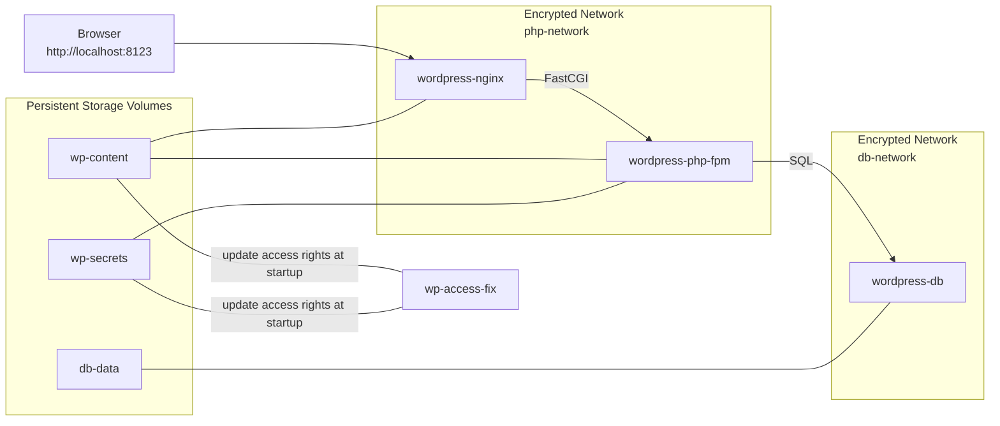

# Minimalistic Secure WordPress Docker Images

Lean, hardened WordPress stack as a monorepo with two submodules:

- [mwaeckerlin/wordpress-nginx]: NGINX WordPress frontend in only 66MB
- [mwaeckerlin/wordpress-php-fpm]: PHP‑FPM WordPress backend in only 116MB

This splitting is in accordance to Docker philosophy of having only one server process per image and to NGINX which splits PHP processing into a separate service. It therefore also follows strong microservice architecture. 

Both together are the most lean and secure images for Wordpress:
 - extremely small size, minimalistic dependencies
 - no shell, only the server command
 - small attack surface
 - starts as non root user
 - configurations and secrets hidden in the second layer service
 - all PHP files are empty, since they are not needed in NGINX

86MB is mostly the size of the WordPress distribution itself, and stored in both images.

Compared to the official [wordpress], this package has:
 - Less attack surface.
 - Better encapsulation.
 - Running as non priviledged user.
 - Much smaller: ~66MB (nginx) + ~116MB (php-fpm) vs. ~727MBMB for the official fpm based image.
 - Clear segmentation: only NGINX can reach PHP, only PHP can reach the DB; networks are isolated and marked `encrypted` (e.g. when run in Docker Swarm)
 - Headless: no shell, no package manager at runtime.
 - Configurable via environment (NGINX through envwrap templates, WordPress via `wp-config.php`).
 - Configuration `wp-config.php` and secrets `wp-secrets/wp-secrets.php` not available in NGINX frontend.
 - No Wordpress PHP file available in NGINX frontend, all files emptied.


## Volumes / Persistence

All mutable WordPress data lives in `/app/wp-content` and the generated secrets in `/app/wp-secrets`.

To keep plugins/themes/uploads and to let both containers see the same files, mount the named volume `wp-content` into **[mwaeckerlin/wordpress-nginx]** and **[mwaeckerlin/wordpress-php-fpm]** (already defined in the top-level `docker-compose.yml`).

Mount `/app/wp-secrets` to **wordpress-php-fpm** to keep sessions up between process restarts (or when scaling up replicas).

**Permissions** on the volume: the runtime user comes from the base images and is not root. When the volume is created, the helper service `wp-access-fix` (based on `mwaeckerlin/very-base`) runs `ALLOW_USER` once on `/app/wp-content`; after that you can stop it and the volume keeps its owner.


## Environment Variables

- wordpress-nginx
  - `PHP_FPM_HOST` (default mwaeckerlin/php-fpm]): upstream host for FastCGI.
  - `PHP_FPM_PORT` (default `9000`): upstream port.
- wordpress-php-fpm
  - mandatory to change
    - `WORDPRESS_DB_PASSWORD`: DB user password; **change in production** to a strong secret matching your DB.
  - optional to change
    - `WORDPRESS_DB_USER`: DB user; defaults to `wordpress`, change if you use another user.
    - `WORDPRESS_DB_NAME`: DB name; defaults to `wordpress`, change if your schema differs.
    - `WORDPRESS_DB_HOST`: DB host; defaults to `mysql`, set to your DB host it it's named differently.
    - `WORDPRESS_DB_PORT`: DB port; defaults to `3306`, fits mysql and mariadb, adjust if your DB listens elsewhere. if your DB listens elsewhere.
    - `WORDPRESS_HOME`: Base URL of the wordpress home (optional).
    - `WORDPRESS_SITEURL`: Base URL of the wordpress site (optional).
    - `WORDPRESS_TABLE_PREFIX`: table prefix; default `wp_`, change if you want a custom prefix.
    - `NGINX_HOST`: Internal hostname:port for container-to-container requests (optional, default: `wordpress-nginx:8080`).
    - `WORDPRESS_DB_CHARSET`: default `utf8mb4`, typically keep.
    - `WORDPRESS_DB_COLLATE`: default empty (WordPress picks a sensible collate), typically keep.
    - `WORDPRESS_DEBUG`: Simple debug control (default: `false`).
      - `false`/empty/`0`: Debug completely off.
      - `true`/`on`/`yes`/`1`: Debug on, no log, no display.
      - `log`: Debug on, writes errors to `wp-content/debug.log` (recommended for analysis).
      - `display`: Debug on, shows errors directly in the browser (development only).
      - `all`: Debug on, log and display enabled (short‑term deep diagnostics).
    - `WORDPRESS_DEBUG_LOG`: Optional log file path (e.g. `wp-content/logs/debug.log`); used when debug mode is `log` or `all`.
  - Salt and Session Secrets: persisted at first run (only evaluated at the very first start)
    - `WORDPRESS_AUTH_KEY`\
      `WORDPRESS_SECURE_AUTH_KEY`\
      `WORDPRESS_LOGGED_IN_KEY`\
      `WORDPRESS_NONCE_KEY`\
      `WORDPRESS_AUTH_SALT`\
      `WORDPRESS_SECURE_AUTH_SALT`\
      `WORDPRESS_LOGGED_IN_SALT`\
      `WORDPRESS_NONCE_SALT`: cryptographic salts/keys for cookies/sessions; **must be set to strong unique secrets**, they all default to strong random values


## Docker Compose Setup

We will have the following network setup:



Complete and secure `docker-compose.yml`:

```yaml
services:
  wordpress-nginx:
    image: mwaeckerlin/wordpress-nginx
    ports:
      - "8123:8080"
    volumes:
      - wp-content:/app/wp-content
    networks:
      - php-network

  wordpress-php-fpm:
    image: mwaeckerlin/wordpress-php-fpm
    environment:
      WORDPRESS_DB_PASSWORD: ThisIsMandaToryToBeSet
      WORDPRESS_DB_HOST: wordpress-db
    volumes:
      - wp-content:/app/wp-content
      - wp-secrets:/app/wp-secrets
    networks:
      - php-network
      - db-network
    depends:
     - wp-access-fix

  wordpress-db:
    image: mariadb
    environment:
      MYSQL_DATABASE: wordpress
      MYSQL_USER: wordpress
      MYSQL_PASSWORD: ThisIsMandaToryToBeSet
      MYSQL_RANDOM_ROOT_PASSWORD: yes
    volumes:
      - db-data:/var/lib/mysql
    networks:
      - db-network

  wp-access-fix:
    image: mwaeckerlin/allow-write-access
    volumes:
      - wp-content:/app/wp-content
      - wp-secrets:/app/wp-secrets

volumes:
  wp-content:
  wp-secrets:
  db-data:

networks:
  php-network:
    driver_opts:
      encrypted: 1
  db-network:
    driver_opts:
      encrypted: 1
```

Service Roles:
- [mwaeckerlin/wordpress-nginx]: HTTP endpoint; forwards PHP to [mwaeckerlin/wordpress-php-fpm] via `PHP_FPM_HOST`/`PHP_FPM_PORT`.
- [mwaeckerlin/wordpress-php-fpm]: runs WordPress/PHP-FPM; reads DB settings from `WORDPRESS_DB_*`; writes to `/app/wp-content`.
- `mysql`: database reachable only from PHP.
- `wp-access-fix`: one-time chown on the shared volume. FYI: `${ALLOW_USER}` is provided by `mwaeckerlin/very-base` and resolves to the proper chown command to give access to the runtime user.


## Network Topology

In the best setup, there are internally two completely separated distinct networks, encrypted and lockt from outside access.

- `php-network`: only [mwaeckerlin/wordpress-nginx] ↔ [mwaeckerlin/wordpress-php-fpm].
- `db-network`: only [mwaeckerlin/wordpress-php-fpm] ↔ `mysql`.
- No direct DB access from NGINX nor from outside; no direct PHP access from outside.


## Build and Development

The images are available directly from Docker Hub, there is no need to build. But if you want to build them:

1) After `git clone`, init and update the submodules: `git submodule update --init --remote --recursive`
2) Build the images: `docker compose build`
3) Start the whole setup: `docker compose up`
4) Stop and tear down all containers: `docker compose down`  

After `docker compose up` you may connect to wordpress at: http://localhost:8123


## Notes on Submodules

- [mwaeckerlin/wordpress-nginx]: serves `/app` via NGINX, uses envwrap to inject `${PHP_FPM_HOST}`/`${PHP_FPM_PORT}` from ENV into NGINX config. See `wordpress-nginx/README.md`.
- [mwaeckerlin/wordpress-php-fpm]: delivers WordPress, expects DB params from ENV (defaults in the Dockerfile) and writes to `/app/wp-content`. See `wordpress-php-fpm/README.md`.
- [mwaeckerlin/nginx] / mwaeckerlin/php-fpm] base: describe the headless base images and ENV configuration; see their READMEs.

[mwaeckerlin/wordpress-nginx]: https://github.com/mwaeckerlin/wordpress-nginx "NGINX Service for WordPress"
[mwaeckerlin/wordpress-php-fpm]: https://github.com/mwaeckerlin/wordpress-php-fpm "PHP-FPM Service for WordPress"
[mwaeckerlin/nginx]: https://github.com/mwaeckerlin/nginx "NGINX Service Base Image"
[mwaeckerlin/php-fpm]: https://github.com/mwaeckerlin/php-fpm "PHP-FPM Service Base Image"
[wordpress]: https://hub.docker.com/_/wordpress "the official wordpress docker image"

## Debugging

Control WordPress debugging via `WORDPRESS_DEBUG` without touching code:

- What is "log"? Writes errors to `wp-content/debug.log` inside the WordPress folder. No UI impact; ideal for production analysis.
- What is "display"? Shows errors directly in the browser (HTML). Great for development; avoid in production.
- Custom log path: set `WORDPRESS_DEBUG_LOG=wp-content/logs/debug.log` (or an absolute path) when using `log`/`all`.

Typical setups:

- Production: `WORDPRESS_DEBUG=false`
- Analysis without impacting UI: `WORDPRESS_DEBUG=log`
- Local development: `WORDPRESS_DEBUG=display`
- Short‑term deep diagnostics: `WORDPRESS_DEBUG=all`

Docker Compose example:

```yaml
services:
  wordpress-php-fpm:
    image: mwaeckerlin/wordpress-php-fpm
    environment:
      WORDPRESS_DB_PASSWORD: <secret>
      WORDPRESS_DB_HOST: wordpress-db
      WORDPRESS_DEBUG_LOG: wp-content/debug.log
    volumes:
      - wp-content:/app/wp-content
      - wp-secrets:/app/wp-secrets
```

Quick checks:

```bash
# View the log when WORDPRESS_DEBUG=log|all
docker exec -it wordpress-php-fpm sh -lc 'tail -n 200 /app/wp-content/debug.log'

# For display mode, open the site or admin; errors appear in the HTML
```
